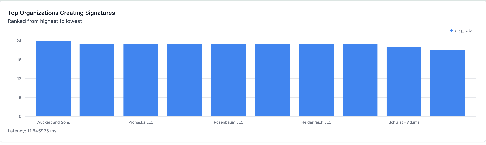

# Real-time Signatures Dashboard

This folder contains all of the code to build the frontend of this demo.

## Deploying the app

This is a NextJS application. Deploy it to the cloud with Vercel.

You'll need to enter your [Tinybird Token](https://www.tinybird.co/docs/concepts/auth-tokens) and Tinybird Host (e.g. https://ui.tinybird.co).

